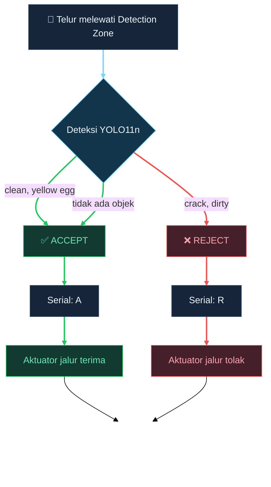
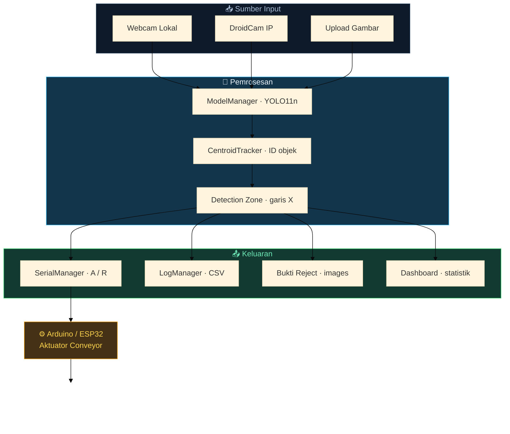
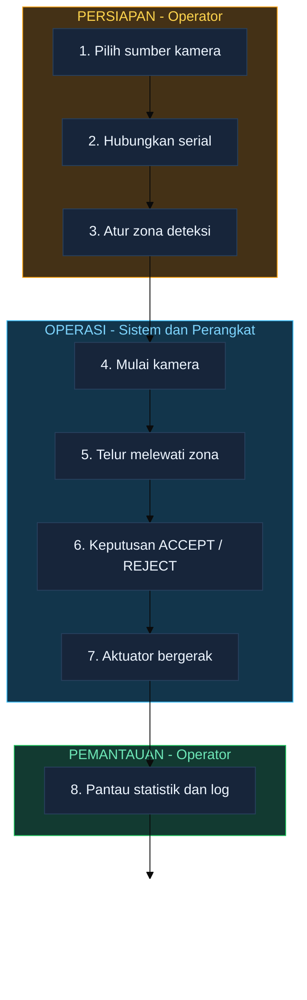

<!-- ============ ANIMATED HEADER ============ -->
<!-- CATATAN: parameter "desc" TIDAK BOLEH memuat karakter "&".
     Server capsule-render menyisipkannya mentah ke dalam XML sehingga SVG
     gagal di-parse (gambar tampil rusak / 0x0). Gunakan "dan", bukan "&". -->
<div align="center">


<!-- ============ ANIMATED TYPING ============ -->
<a href="#-tentang-proyek">
  
</a>

<!-- ============ BADGES ============ -->
<p>
  
  
  
  
</p>
<p>
  
  
  
  
</p>

<!-- ============ METRICS ============ -->
<p>
  
  
  
  
  
</p>

</div>

---

## 📖 Tentang Proyek

**Egg Sorter** adalah aplikasi desktop Windows untuk **klasifikasi dan penyortiran kualitas telur secara otomatis**. Aplikasi menangkap gambar dari webcam atau kamera IP, menjalankan deteksi objek YOLO, memutuskan apakah telur diterima atau ditolak, lalu mengirim perintah ke mikrokontroler untuk menggerakkan aktuator pada conveyor.

> **Nilai inti:** satu telur diperiksa sekali, tepat saat melewati *Detection Zone*, sehingga keputusan konsisten dan tidak terhitung ganda.

### 🎯 Kebijakan Keputusan

<!-- CATATAN TEKNIS:
     1. GitHub menampilkan panel tombol zoom/pan (7 tombol, ~101x101px) di kanan
        bawah setiap diagram mermaid dan TIDAK dapat dimatikan. Karena itu diagram
        disusun vertikal (TD) + node SPACER kosong sebagai penyerap ruang.
     2. Animasi memakai `themeCSS` pada blok init — GitHub terbukti menghormatinya
        (@keyframes ikut tersuntik ke dalam SVG). Efeknya:
        - Garis alur bergerak (stroke-dashoffset) mengikuti arah sistem.
        - Node berdenyut halus sebagai indikator "sistem aktif".
        - Node keputusan berdenyut lebih terang (glow).
     3. linkStyle mewarnai setiap jalur: hijau = ACCEPT, merah = REJECT. -->



---

## 🏗️ Arsitektur Sistem



---

## ✨ Fitur Utama

<table>
<tr>
<td width="50%" valign="top">

### 🔍 Deteksi & Keputusan
- Deteksi objek real-time dengan YOLO11n
- **4 kelas:** `clean`, `crack`, `dirty`, `yellow egg`
- Ambang confidence yang dapat diatur
- Kebijakan reject sadar varian label dataset

### 🎯 Tracking Conveyor
- Pelacakan centroid dengan ID persisten
- Keputusan hanya di **Detection Zone**
- Cooldown **per objek**, bukan global
- Proteksi anti-aktuasi ganda

</td>
<td width="50%" valign="top">

### 🖥️ Dashboard Desktop
- 8 tab operasional berbasis CustomTkinter
- Status langsung: `SIAP` / `AKTIF` / `REJECT`
- Grafik kumulatif ACCEPT vs REJECT
- Notifikasi toast non-blocking

### 🔌 Integrasi Perangkat
- Webcam lokal & DroidCam IP
- Serial ke Arduino/ESP32 (`A` / `R`)
- Uji aktuator dengan konfirmasi keselamatan
- Ekspor log ke CSV

</td>
</tr>
</table>

---

## 🚀 Instalasi

### 1️⃣ Prasyarat

| Komponen | Keterangan |
| --- | --- |
| **OS** | Windows 10 / 11 |
| **Python** | 3.11 |
| **GPU** | NVIDIA + CUDA (opsional, aplikasi berjalan di CPU) |
| **Perangkat** | Webcam/DroidCam, Arduino/ESP32 untuk aktuator |

### 2️⃣ Klon & Environment

```powershell
git clone https://github.com/bagoes3465/PROYEK-KLASIFIKASI-KUALITAS-TELUR.git
cd PROYEK-KLASIFIKASI-KUALITAS-TELUR

python -m venv env
.\env\Scripts\Activate.ps1
```

### 3️⃣ Instal Dependensi

> ⚠️ **Penting — jangan lewati langkah ini.**
> `torch` dan `torchvision` **harus** berasal dari build CUDA yang sama.
> Kombinasi campuran (torch CUDA + torchvision CPU) menyebabkan
> `NotImplementedError` pada `torchvision::nms` saat device diset ke `cuda`.

```powershell
# PyTorch dengan CUDA (wajib dari index PyTorch)
pip install torch==2.14.0+cu130 torchvision==0.29.0+cu130 --index-url https://download.pytorch.org/whl/cu130

# Dependensi lain
pip install -r requirements.txt
```

### 4️⃣ Siapkan Model

Letakkan model hasil training di `models/best.pt`. Model sudah tersedia di repositori ini.

---

## 🎮 Menjalankan Aplikasi

```powershell
# Aktifkan environment
.\env\Scripts\Activate.ps1

# Jalankan aplikasi utama
python script\app.py
```

Tanpa aktivasi environment:

```powershell
.\env\Scripts\python.exe script\app.py
```

### 🧭 Alur Kerja Operator

<!-- Alur operasional dirender sebagai flowchart (bukan journey) karena:
     - journey memakai SVG berskala tetap (600x154) sehingga tugas terakhir
       selalu tertutup tombol zoom GitHub dan tidak dapat diberi spacer;
     - flowchart mendukung node SPACER, linkStyle, dan animasi themeCSS.
     Animasi: garis alur bergerak (seq), node berdenyut (act), fase berdenyut (phase). -->



**Langkah operasional:**

1. Buka tab **Detection**, pilih **Upload Gambar** atau **Mulai Kamera**.
2. Atur sumber kamera pada tab **Camera** (Webcam lokal atau DroidCam IP).
3. Sesuaikan zona pada tab **Detection Zone**: confidence, posisi garis X, toleransi, cooldown.
4. Hubungkan perangkat pada tab **Serial Port**, lalu uji aktuator.
5. Pantau hasil pada tab **Logs** dan **Chart**.

### ⌨️ Pintasan Keyboard

| Tombol | Fungsi |
| --- | --- |
| `Esc` | Hentikan kamera |
| `F5` | Muat ulang log |

---

## 🖥️ Antarmuka

| Tab | Fungsi |
| --- | --- |
| 📹 **Detection** | Unggah gambar, mulai/stop kamera, status operasional |
| 🎥 **Camera** | Pilih webcam lokal atau DroidCam IP |
| 🎯 **Detection Zone** | Confidence, posisi zona, toleransi, cooldown |
| 🔌 **Serial Port** | Koneksi Arduino/ESP32, baud rate, uji aktuator |
| 🧠 **Model** | Device CPU/CUDA, logging, alert, simpan/muat konfigurasi |
| 🎓 **Training** | Konfigurasi dan pemantauan training YOLO |
| 📂 **Logs** | Riwayat deteksi, refresh, ekspor, hapus |
| 📊 **Chart** | Grafik kumulatif ACCEPT vs REJECT |

---

## 📊 Dataset

Dataset didefinisikan melalui `data.yaml` dan bersumber dari Roboflow.

| Dataset | Kelas | Train | Valid | Test |
| --- | ---: | ---: | ---: | ---: |
| `dataset/datav11` | 4 | 2.188 | 1.240 | 1.053 |
| `dataset/dataV8` | 6 | 3.354 | 323 | 161 |
| `dataset/dataV12` | 6 | 3.354 | 323 | 161 |

<details>
<summary><b>🏷️ Detail kelas per dataset</b></summary>

**`datav11` — 4 kelas** (selaras dengan model produksi):
`clean` · `crack` · `dirty` · `yellow egg`

**`dataV8` & `dataV12` — 6 kelas:**
`CalciumCoatedeggs` · `Discoloredeggs` · `SoftshellEgg` · `crackeggs` · `dirtyeggs` · `normaleggs`

> Aplikasi mengenali **kedua varian penamaan** label rusak (`crack`/`crackeggs` dan `dirty`/`dirtyeggs`), sehingga model dari keluarga dataset mana pun tetap memberi keputusan reject yang benar.

</details>

---

## 🏋️ Training

### YOLO11n — Dataset 4 Kelas

```powershell
.\env\Scripts\python.exe script\train_dataset.py
```

Konfigurasi: 100 epoch · batch 8 · imgsz 416 · optimizer SGD · patience 20 · AMP aktif

| Metrik | Nilai |
| --- | ---: |
| Precision | **94,81%** |
| Recall | **95,25%** |
| mAP50 | **98,18%** |
| mAP50-95 | **94,02%** |

### Melalui GUI

Tab **Training** menyediakan konfigurasi dataset, base model, epoch, batch, image size, workers, patience, cache, AMP, dan plots. Training berjalan di thread terpisah dan dapat dihentikan dengan tombol **Stop Training**.

---

## 📁 Struktur Proyek

```text
PROYEK_KLASIFIKASI_TELUR/
│
├── 📄 README.md                  Dokumentasi utama
├── 📄 requirements.txt           Manifest dependensi
├── 📄 app_config.json            Konfigurasi runtime
├── 📄 log_deteksi.csv            Riwayat deteksi
│
├── 📂 script/
│   ├── app.py                    ⭐ Aplikasi utama (GUI lengkap)
│   ├── train_dataset.py          ⭐ Training YOLO11n (4 kelas)
│   ├── split_data.py             Pembagi dataset
│   └── main.py · tes.py · tes_cuda.py    Varian GUI lama
│
├── 📂 models/
│   └── best.pt                   ⭐ Model produksi (4 kelas)
│
├── 📂 dataset/                   Dataset YOLO (datav11 · dataV8 · dataV12)
├── 📂 runs/detect/               Artefak training & metrik
├── 📂 rejected_images/           Bukti gambar reject
└── 📂 docs/                      Laporan akhir proyek (tidak di-commit)
```

---

## ⚙️ Konfigurasi

Konfigurasi tersimpan di `app_config.json`.

| Kunci | Default | Keterangan |
| --- | --- | --- |
| `ip_camera` | `192.168.1.6` | Alamat IP DroidCam |
| `min_conf` | `0.3` | Ambang confidence minimum |
| `aktifkan_log` | `true` | Aktifkan penulisan log |
| `device` | `cpu` | Device inferensi (`cpu` / `cuda`) |
| `serial_port` | `COM9` | Port perangkat serial |
| `serial_baudrate` | `115200` | Baud rate serial |
| `detection_zone_x` | `320` | Koordinat X garis zona deteksi |
| `detection_zone_tolerance` | `50` | Toleransi zona (± piksel) |
| `decision_cooldown` | `2.0` | Jeda minimum per objek (detik) |

---

## 📝 Log Deteksi

Setiap keputusan tercatat pada `log_deteksi.csv` dengan skema:

```csv
waktu,sumber,object_id,kelas_terdeteksi,keputusan,confidence,inference_time_ms,fps,serial_sent
2025-11-26 19:51:05,Kamera (Tracking),ID-13,yellow egg,ACCEPT,0.73,28.5,23.5,Yes
2025-11-26 19:52:23,Kamera (Tracking),ID-21,crack,REJECT,0.50,30.6,18.6,Yes
```

| Kolom | Keterangan |
| --- | --- |
| `waktu` | Waktu keputusan dibuat |
| `sumber` | Asal gambar (`Kamera (Tracking)` / `Upload Gambar`) |
| `object_id` | ID tracking objek |
| `kelas_terdeteksi` | Label hasil model |
| `keputusan` | `ACCEPT` atau `REJECT` |
| `confidence` | Skor keyakinan deteksi |
| `inference_time_ms` | Durasi inferensi (ms) |
| `fps` | Frame rate aliran kamera |
| `serial_sent` | Hasil pengiriman perintah yang sebenarnya |

> **Catatan:** kolom `serial_sent` mencatat hasil nyata dari `send_decision()`, bukan sekadar status port terhubung — sehingga kegagalan komunikasi aktuator tetap terlihat pada audit trail.

---

## ⚠️ Catatan Keselamatan

Aplikasi ini mengendalikan perangkat fisik.

- Tombol **uji aktuator** memerlukan konfirmasi operator sebelum mengirim perintah.
- Pastikan area conveyor aman sebelum memulai operasi.
- Aplikasi **tidak** menyediakan tombol *emergency stop*; gunakan penghentian darurat pada perangkat keras.
- Muat hanya berkas model `.pt` yang Anda percayai. Checkpoint PyTorch dari sumber tidak tepercaya berpotensi mengeksekusi kode saat dimuat. Aplikasi meminta konfirmasi bila model berada di luar folder proyek.

---

## 🔧 Pemecahan Masalah

<details>
<summary><b>❌ <code>NotImplementedError</code> pada <code>torchvision::nms</code> saat memilih CUDA</b></summary>

**Penyebab:** `torch` dan `torchvision` berasal dari build berbeda — biasanya torch versi CUDA dengan torchvision versi CPU.

**Periksa:**

```powershell
.\env\Scripts\python.exe -c "import torch, torchvision; print(torch.__version__, torchvision.__version__)"
```

Kedua versi harus berakhiran `+cu130`. Jika torchvision berakhiran `+cpu`:

```powershell
.\env\Scripts\python.exe -m pip install --upgrade --no-deps torchvision==0.29.0+cu130 --extra-index-url https://download.pytorch.org/whl/cu130
```

</details>

<details>
<summary><b>🎥 Kamera tidak terdeteksi</b></summary>

- Tutup aplikasi lain yang memakai kamera (Zoom, Teams, OBS).
- Untuk DroidCam, pastikan ponsel dan PC berada di jaringan yang sama, lalu uji `http://<ip>:4747/video` di peramban.
- Gunakan tombol **Refresh** pada tab Camera untuk memindai ulang perangkat.

</details>

<details>
<summary><b>🔌 Serial gagal terhubung</b></summary>

- Tutup Serial Monitor Arduino IDE — hanya satu proses yang dapat memegang port COM.
- Pastikan baud rate aplikasi sama dengan `Serial.begin()` pada firmware.
- Periksa port melalui **Device Manager** → *Ports (COM & LPT)*.

</details>

<details>
<summary><b>🐢 Inferensi lambat</b></summary>

- Aktifkan CUDA pada tab Model bila tersedia GPU NVIDIA.
- Turunkan resolusi kamera atau naikkan ambang `min_conf`.
- Tutup aplikasi berat lain yang memakai VRAM.

</details>

---

## 📚 Dokumentasi

> Folder `docs/` **tidak disertakan** dalam repositori ini (lihat `.gitignore`). Laporan akhir proyek tersedia secara terpisah dari pemilik proyek.

Dokumentasi teknis lengkap tersedia langsung di repositori:

| Berkas | Isi |
| --- | --- |
| `README.md` | Dokumen ini — panduan instalasi, penggunaan, dan pemecahan masalah |
| `script/app.py` | Docstring dan komentar pada kode sumber aplikasi |
| `dataset/*/data.yaml` | Definisi kelas dan path dataset |
| `runs/detect/*/args.yaml` | Konfigurasi training yang benar-benar dijalankan |

---

## 🗺️ Peta Jalan

- [x] Deteksi 4 kelas dengan YOLO11n
- [x] Tracking objek & zona keputusan conveyor
- [x] Integrasi serial Arduino/ESP32
- [x] Dashboard operasional & grafik
- [x] Pengerasan thread-safety & audit log
- [ ] Test otomatis (unit + integrasi)
- [ ] Pengemasan installer Windows
- [ ] Dukungan multi-kamera

---

<div align="center">

### 🥚 Egg Sorter

**Dibuat untuk otomatisasi quality control telur**


</div>