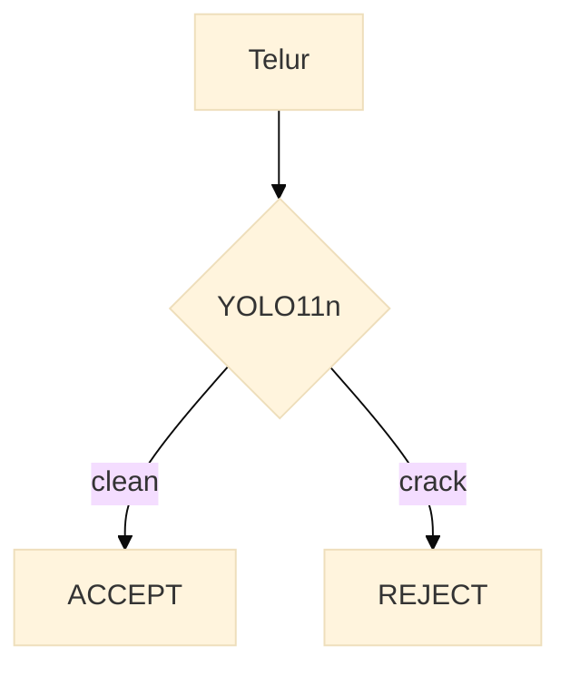

# Animation test

```mermaid
%%{init: {'theme':'base','themeCSS':'@keyframes dashflow{to{stroke-dashoffset:-1000}}.edgePath .path,.flowchart-link{stroke-dasharray:6 6!important;animation:dashflow 30s linear infinite!important}@keyframes nodepulse{0%,100%{opacity:1}50%{opacity:.5}}g.node{animation:nodepulse 2s ease-in-out infinite}'}}%%
flowchart TD
    A["Telur"] --> B{"YOLO11n"}
    B -->|"clean"| C["ACCEPT"]
    B -->|"crack"| D["REJECT"]
```
